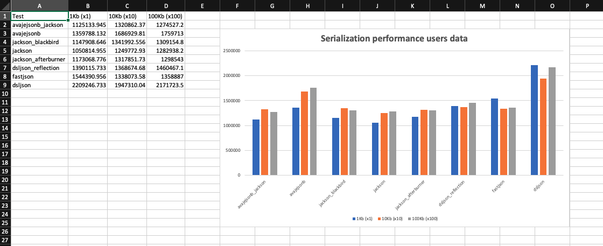

# Benchmark of Java JSON libraries

<!-- TOC -->
* [Benchmark of Java JSON libraries](#benchmark-of-java-json-libraries)
  * [Purpose](#purpose)
  * [Results](#results)
    * [Benchmark configuration](#benchmark-configuration)
  * [Run](#run)
<!-- TOC -->

## Purpose

This project benchmarks the throughput performance of a variety of Java JSON libraries
using [JMH](https://openjdk.org/projects/code-tools/jmh/).
It covers the following libraries:

* [jackson](https://github.com/fasterXML/jackson)
* [fastjson](https://github.com/alibaba/fastjson)
* [dsl-json](https://github.com/ngs-doo/dsl-json)
* [avaje-jsonb](https://github.com/avaje/avaje-jsonb)

When available, both databinding and 'stream' (custom packing an unpacking) implementations are tested.
Two different kinds of [models](src/main/java/github/io/truongbn/jsonclients/model) are evaludated with payloaded of 1,
10, 100 and 1000 KB size:

* [`Users`](src/main/java/github/io/truongbn/jsonclients/model/Users.java): uses primitive types, String, List and
  simple POJOs.
* [`Clients`](src/main/java/github/io/truongbn/jsonclients/model/Clients.java): adds arrays, enum, UUID, LocalDate.

This benchmark is written to:

* Randomly generate payloads upon static loading of the JVM/benchmark, the *seed* is also shared across runs.
* Read data from RAM.
* Write data to reusable output streams (when possible), this reduces allocation pressure.
* Consume all output streams to avoid dead code elemination optimization.

Not evaluated are: RAM utilization, compression, payloads > 1 MB.

## Results

The benchmarks are written with [JMH](https://openjdk.org/projects/code-tools/jmh/) and for Java 17.




### Benchmark configuration

JMH info:

```
# JMH version: 1.36
# VM version: JDK 17.0.4.1, OpenJDK 64-Bit Server VM, 17.0.4.1+1
# VM invoker: /Library/Java/JavaVirtualMachines/temurin-17.jdk/Contents/Home/bin/java
# VM options: --add-opens=java.base/java.time=ALL-UNNAMED -Xms2g -Xmx2g
# Blackhole mode: compiler (auto-detected, use -Djmh.blackhole.autoDetect=false to disable)
# Warmup: 5 iterations, 10 s each
# Measurement: 10 iterations, 3 s each
# Timeout: 10 min per iteration
# Threads: 16 threads, will synchronize iterations
# Benchmark mode: Throughput, ops/time
```

## Run

By default, running `./run ser` (`./run deser` respectively) will run all -- stream and databind -- serialization (
deserialization respectively) benchmarks with 1 KB payloads of _Users_.

You can also specify with libs, apis, payload-sizes and number of iterations (and more) you want to run. for example:

    ./run deser --apis stream --libs jackson
    ./run ser --apis databind,stream --libs jackson
    ./run deser --apis stream --libs dsljson,jackson --size 10 --datatype users

Type `./run help ser` or `./run help deser` to print help for those commands.